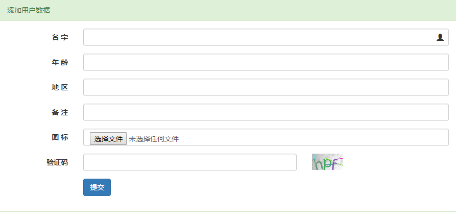

# 一个简单的laravel增删查改上传文件验证码范例

放到本地方法:
git clone https://github.com/mabenteng/laravel-demo.git

修改.env.example配置自己本地数据库

懒得写migrate迁移文件就直接导入sql好了.数据库名laravel

> **添加用户页面**
 

>  **显示用户列表页面**
 

> **修改用户资料页面**
 

没有什么需求,就没有添加用户登录注册等页面,可以自己fork然后添加基类控制器然后判断session,后来实在忍受不了丑陋的界面又花了时间用bootstrap修饰了一番,可拿走直接用.已经包含了文件上传和验证码验证,基本可以以此添加其他想要的功能了.

之前没有用过laravel,所以研究了一番练手做了这样一个项目,可能有很多不足之处,欢迎大神指导拍砖.

